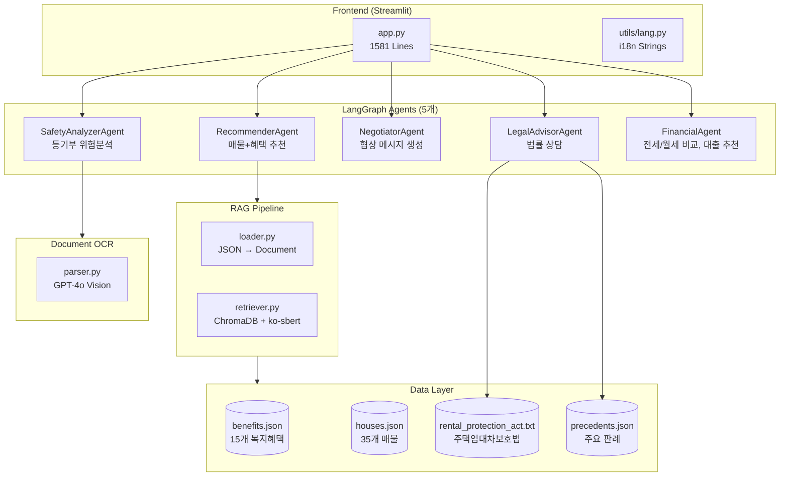

# 🏠 Young & Home - 프로젝트 한눈에 보기

---

## 🎯 이 프로젝트가 뭔가요?

> **"청년들이 안전하게 집을 구할 수 있도록 AI가 처음부터 끝까지 도와주는 서비스"**

### 📌 간단 요약

| 문제 | 해결책 |
|------|--------|
| 😰 "어떤 복지 혜택 받을 수 있지?" | → AI가 내 조건에 맞는 **정부 지원금/대출** 자동 매칭 |
| 😰 "이 집 전세사기 아닐까?" | → **등기부등본 업로드**하면 위험도 자동 분석 |
| 😰 "집주인한테 뭐라고 말해야 하지?" | → AI가 **협상 메시지** 대신 작성 |
| 😰 "계약서 조항이 이해가 안돼" | → **법률 챗봇**이 쉽게 설명 |

---

### ✨ 주요 기능 4가지

```
1️⃣ 스마트 매물 검색
   → 내 조건(나이, 소득, 희망 월세) 입력하면 받을 수 있는 혜택 + 추천 매물을 한번에!

2️⃣ 등기부 위험 분석  
   → PDF나 사진만 올리면 "깡통전세 위험", "압류 있음" 등 자동 진단

3️⃣ 협상 메시지 생성
   → "보증보험 가입 요청", "수리 요청" 등 상황별 정중한 메시지 자동 작성

4️⃣ 법률 상담 챗봇
   → "집주인이 1달 전에 나가라고 하면?" 같은 질문에 법 조항 근거로 답변
```

---

### 🛠️ 사용된 기술

- **프론트엔드**: Streamlit (웹 대시보드)
- **AI 엔진**: OpenAI GPT-4 + LangChain/LangGraph
- **검색**: ChromaDB (벡터 검색으로 혜택 매칭)
- **문서 분석**: GPT-4 Vision (등기부등본 이미지 분석)

---

### 💡 왜 만들었나요?

2026 서강대 AI 겨울캠프 해커톤에서 **"청년 주거 문제"**를 해결하고자 개발했습니다.
- 전세사기, 깡통전세 피해 증가
- 청년들이 복잡한 부동산 정보/법률을 모름
- 정부 지원 혜택을 놓치는 경우 많음

**→ AI가 떠먹여주는 청년 주거 토탈 케어!**

---

---

# 📘 개발자용 상세 문서

> 아래부터는 개발자를 위한 기술 문서입니다.

---

## 🏗️ 프로젝트 아키텍처 개요



---

## 📁 디렉토리 구조

```
young-and-home/
├── app.py                    # Streamlit 메인 앱 (1581줄)
├── .env                      # 환경변수 (OPENAI_API_KEY)
├── requirements.txt          # 의존성 패키지
│
├── src/
│   ├── agents/              # LangGraph 에이전트들 (5개)
│   │   ├── recommender.py   # 🏠 주거 추천 (459줄)
│   │   ├── analyzer.py      # ⚖️ 위험 분석 (364줄)
│   │   ├── negotiator.py    # 💬 협상 생성 (148줄)
│   │   ├── finance.py       # 💰 금융 계산 (192줄)
│   │   └── legal.py         # 📜 법률 상담 (57줄)
│   │
│   ├── rag/                 # RAG 파이프라인
│   │   ├── loader.py        # JSON → Document 변환
│   │   └── retriever.py     # ChromaDB 벡터 검색
│   │
│   ├── ocr/                 # 문서 인식
│   │   └── parser.py        # GPT-4o Vision 분석
│   │
│   └── utils/
│       └── lang.py          # 한/영 다국어 스트링
│
├── data/
│   ├── welfare/benefits.json  # 청년 복지 혜택 15개
│   ├── housing/houses.json    # 수도권 매물 35개
│   └── legal/
│       ├── rental_protection_act.txt
│       └── precedents.json    # 주요 임대차 판례
│
└── n8n/                      # 자동화 워크플로우 (미연동)
```

---

## 🔧 핵심 에이전트 설명

### 1. RecommenderAgent (매물 추천)

**흐름:** 프로필 수집 → RAG 혜택 검색 → 매물 필터링 → 리포트 생성

```python
# 핵심 코드
agent = RecommenderAgent(openai_api_key=API_KEY)
result = agent.run("신촌에서 월세 50만원 이하", language="KO")
```

### 2. SafetyAnalyzerAgent (위험 분석)

**위험도 계산:**
- LTV(근저당/시세) > 70% → 고위험
- 압류 존재 → +50점
- 선순위 임차인 → +15점

### 3. NegotiatorAgent (협상 메시지)

**지원 유형:**
- 보증보험 가입 요청
- 특약 조항 추가
- 수리 요청
- 계약 조건 변경

### 4. LegalAdvisorAgent (법률 상담)

**데이터:** 주택임대차보호법 핵심 조항 (제3조~제7조) + 주요 판례

### 5. FinancialAgent (금융 계산)

**기능:**
- 전세 vs 월세 비용 비교 (대출 이자 포함)
- DSR 기반 대출 자격 검사
- 청년 대출 상품 추천 (중기청, 버퀀목, 모바일)

---

## 📊 데이터 현황

| 데이터 | 개수 | 내용 |
|--------|------|------|
| 복지 혜택 | 15개 | 청년월세지원, LH전세임대, SH행복주택, 청년수당 등 |
| 매물 | 35개 | 수도권 전역 (좌표 포함) |
| 법령 | 35줄 | 대항력, 갱신청구권, 증액제한 등 |
| 판례 | 5개 | 전세사기, 보증금 반환 관련 판례 |

---

## 🚀 실행 방법

```bash
# 1. 의존성 설치
pip install -r requirements.txt

# 2. 환경변수 설정
cp .env.example .env
# .env에 OPENAI_API_KEY 입력

# 3. 앱 실행
streamlit run app.py
```

---

## ⚠️ 현재 상태 (알려진 이슈)

| 기능 | 상태 | 비고 |
|------|------|------|
| 매물 검색 | ✅ | 프로필 입력값 반영 |
| 위험 분석 | ✅ | 샘플 데이터 기반 |
| 협상 도우미 | ✅ | 정상 동작 |
| 법률 상담 | ✅ | 판례 검색 지원 |
| 금융 계산기 | ✅ | 전세/월세 비교, 대출 추천 |
| 모니터링 | 🟡 | UI + API 연동 준비 완료 |

---

## 📜 라이선스

MIT License - 2026 서강대 AI 해커톤 Team Young & Home
