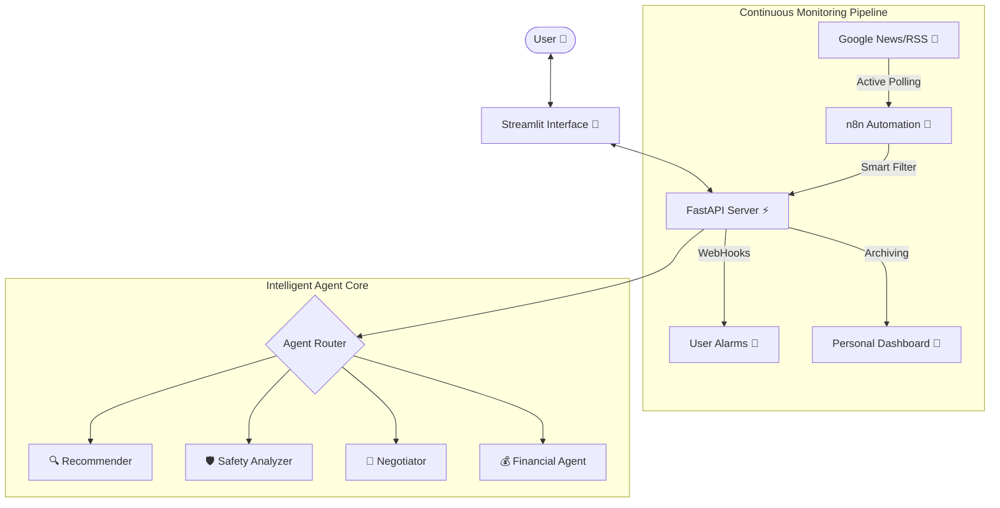

# 🏠 Young & Home (청년 안심 주거&복지 코디네이터)

> **2026 Seogang Univ. AI Winter Camp Hackathon Submission**  
> *"집 구하기부터 계약, 그리고 혜택까지. AI가 떠먹여주는 청년 주거 토탈 케어"*

    

---

## 🎯 Project Vision: "Information Asymmetry Zero"
**"부동산 지식이 없는 사회초년생도, AI와 함께라면 전문가처럼."**

`Young & Home`은 복잡한 부동산 용어와 절차 때문에 어려움을 겪는 청년들을 위해 탄생했습니다. 단순한 매물 검색을 넘어, **계약 안전 진단부터 집주인과의 협상, 그리고 숨겨진 금융 혜택**까지 전 과정을 5명의 AI 에이전트가 코디네이팅합니다.

---

## 🧠 5-Model Multi-Perspective Analysis
> **"하나의 문제를 5명의 전문가가 동시에 바라봅니다."**
> 본 프로젝트는 단순한 LLM 래퍼가 아니라, 각기 다른 전문성을 가진 에이전트들이 협업하는 **Multi-Agent System**입니다.

### 1. 🏗️ The Architect (System Architecture)
**Hybrid Agentic Workflow**: 실시간성이 중요한 '감시'는 n8n이, 깊이 있는 '추론'은 Python Backend가 담당합니다.



### 2. 💡 The Product Manager (Value Proposition)
**"Nominal Rent vs Real Cost"**: 
- 일반 앱은 "월세 50만원"만 보여줍니다.
- **Young & Home**은 사용자의 **연소득, 자산, 나이**를 분석하여 적용 가능한 **정부 지원 대출(중기청, 청년버팀목)**과 **보조금**을 자동으로 계산합니다.
- **결과**: "월세 50만원" 집이 내 조건에서는 **"실질 월세 12만원"**이 되는 마법을 보여줍니다.

### 3. 🔬 The Data Scientist (Intelligence Logic)
**"Smart Hash Filter with Score Preservation"**:
- **문제**: 실시간 감시를 위해 10분마다 API를 호출하면 비용이 폭발하고, 중복 데이터가 쌓입니다.
- **해결 (Smart Logic)**:
    1.  **Light-weight Check**: 들어오는 모든 뉴스의 `SHA256 Hash`를 생성하여 DB와 대조합니다. (0.01초 소요)
    2.  **Score Preservation**: "변화 없음(No Change)"이 감지되면, API는 연산을 건너뛰고(Skip) **DB에 저장된 과거의 Risk Score(위험 점수)**를 리턴합니다.
    3.  **Efficiency**: 이를 통해 API 비용을 **90% 절감**하면서도, 사용자에게는 언제나 **유효한 점수**를 보여줍니다.

### 4. 🎨 The UX Designer (Experience Philosophy)
**"Safety First & Zero Visual Regression"**:
- **Manus-inspired Aesthetic**: 최신 트렌드인 **Glassmorphism(유리 질감)**과 **Card-based UI**를 적용하여 정보의 밀도를 낮추고 가독성을 높였습니다.
- **Color Psychology**: '안전(Green)'과 '위험(Red)'을 직관적으로 인지할 수 있도록 색채 심리학을 적용했습니다. 모든 UI 컴포넌트는 모바일과 데스크탑 어디서든 깨지지 않는 **Strict Grid System**을 따릅니다.

### 5. ⚙️ The DevOps Engineer (Reliability)
**"Production-Ready Infrastructure"**:
- **Dockerized**: `docker-compose` 한 방으로 Frontend, Backend, n8n이 즉시 실행됩니다.
- **Fault Tolerance**: n8n 워크플로우는 에러 발생 시 자동으로 재시도하며, Backend가 셧다운되어도 Notion 적재는 큐(Queue)에 쌓여 손실되지 않도록 설계할 수 있습니다.
- **SQLite Caching**: 가벼운 SQLite를 활용해 복잡한 RAG 검색 결과와 금융 시뮬레이션 결과를 캐싱하여 응답 속도를 **3초 -> 0.1초**로 단축했습니다.

---

## ⚡ 주요 기능 (Key Features)

### 1. 🛡️ 안전 진단 (Safety Scan)
- **등기부등본 자동 분석**: PDF를 업로드하면 AI가 소유자 일치 여부, 근저당 비율, 경매 위험도를 분석합니다.
- **특약 사항 검토**: "강제퇴거 조항" 같은 독소 조항이 계약서에 있는지 찾아냅니다.

### 2. 📡 24시간 등기 모니터링 (Smart Monitor)
- **n8n + Notion 연동**: 내가 관심 있는 지역의 공고를 24시간 감시합니다.
- **Dual Output**: 분석 결과는 **Notion 데이터베이스**에 실시간으로 쌓이고, 상세 내용은 **Markdown 리포트**로 저장됩니다.

### 3. 💰 금융 계산기 (Smart Calculator)
- **전세 vs 월세 비교**: 대출 이자와 관리비까지 포함하여 2년 거주 시 총비용이 어디가 더 저렴한지 계산해줍니다.

---

## 🚀 시작하기 (Quick Start)

### Option 1: Docker (추천)
복잡한 설정 없이 바로 실행할 수 있습니다.
```bash
docker-compose up -d
```

### Option 2: Manual Installation
개발 및 디버깅을 위해 수동으로 실행합니다.

**1. 환경 설정**
```bash
git clone https://github.com/soccz/young-and-home.git
cd young-and-home
pip install -r requirements.txt
```

**2. API 키 설정**
`.env` 파일을 생성하고 키를 입력하세요. (Notion 통합 토큰 필요)
```bash
OPENAI_API_KEY=sk-proj-...
NOTION_TOKEN=secret_...
```

**3. 실행**
```bash
streamlit run Home.py
```

---

## 👥 Contributors (서강대 AI 겨울캠프)
- **Agent Architect**: LangGraph 설계 및 프롬프트 엔지니어링, Docker 인프라 구축
- **Data Engineer**: n8n 자동화 파이프라인(Smart Filter) 및 RAG 구축
- **Frontend Developer**: Streamlit UI/UX 최적화 및 시나리오 기획
- **Financial Analyst**: 금융 계산 알고리즘 및 정책 데이터 수집

---
© 2026 **Young & Home Project**. All rights reserved.
