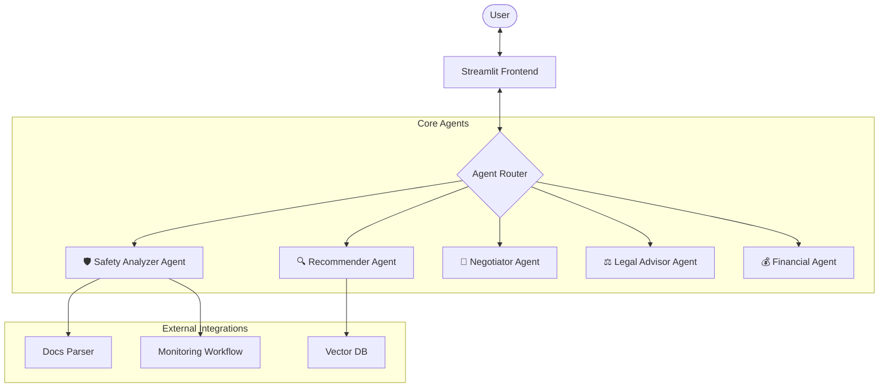

# Young & Home (청년 안심 주거&복지 코디네이터)

> **2026 Seogang Univ. AI Winter Camp Hackathon Submission**  
> *"집 구하기부터 계약, 그리고 혜택까지. AI가 떠먹여주는 청년 주거 토탈 케어"*

   

## 🎯 프로젝트 개요

**"부동산 지식이 없는 사회초년생도, AI와 함께라면 전문가처럼."**

`Young & Home`은 복잡한 부동산 용어와 절차 때문에 어려움을 겪는 청년들을 위해 탄생했습니다. 단순한 매물 검색을 넘어, **계약 안전 진단부터 집주인과의 협상, 그리고 거주 중 법적 보호**까지 전 과정을 AI 에이전트가 도와줍니다.

---

## 🏗️ 시스템 아키텍처 (Multi-Agent System)

이 프로젝트는 **LangGraph** 기반의 5가지 특화 에이전트가 유기적으로 협력합니다.



### 🤖 핵심 Agent 소개
1. **🔍 Recommender Agent**: 사용자 상황(소득/직업/자산)을 분석하여 최적의 매물과 정부 지원 대출(중기청, 버팀목 등)을 추천합니다.
2. **🛡️ Safety Analyzer Agent**: **등기부등본**과 **건축물대장**을 OCR로 분석하여, 숨겨진 빚(근저당)이나 위반 건축물 여부를 찾아내고 "전세지킴 보증보험" 가입 가능성을 진단합니다.
3. **📝 Negotiator Agent**: 집주인에게 말하기 껄끄러운 요청(수리, 특약 추가)을 **가장 정중하고 효과적인 문구**로 작성해줍니다.
4. **⚖️ Legal Advisor Agent**: 주택임대차보호법 판례 데이터를 기반으로, 보증금 반환/계약 갱신 등 곤란한 법적 문제에 대한 솔루션을 제공합니다.
5. **💰 Financial Agent**: 전세 vs 월세 비교 분석, DSR/LTV 시뮬레이션을 통해 내 지갑을 지켜줍니다.

---

## ⚡ 주요 기능 (Key Features)

### 1. 🛡️ 안전 진단 (Safety Scan)
- **등기부등본 자동 분석**: PDF를 업로드하면 AI가 소유자 일치 여부, 근저당 비율, 경매 위험도를 3초 만에 분석합니다.
- **특약 사항 검토**: "강제퇴거 조항" 같은 독소 조항이 계약서에 있는지 찾아냅니다.

### 2. 📝 협상 도우미 (Negotiation Assistant)
- **상황별 맞춤 문자 생성**: "누수 수리 요청", "보증금 반환 독촉", "계약 연장 거절" 등 상황만 입력하면 AI가 문자를 써줍니다.

### 3. 📡 24시간 등기 모니터링 (Security Center)
- **n8n 자동화 연동**: 거주 중인 집의 등기부등본을 주기적으로 조회하여, 집주인이 몰래 대출을 받거나 압류가 들어오면 **즉시 알림(Slack/Kakao)**을 보냅니다.

### 4. 💰 금융 계산기 (Smart Calculator)
- **전세 vs 월세 비교**: 대출 이자와 관리비까지 포함하여 2년 거주 시 총비용이 어디가 더 저렴한지 계산해줍니다.

---

## 🛠️ 기술 스택 (Tech Stack)

| Category | Technology | Usage |
|----------|------------|-------|
| **Frontend** | Streamlit | 반응형 웹 UI 구성, Custom CSS/JS 컴포넌트 |
| **Orchestration** | LangChain, LangGraph | Multi-Agent 상태 관리 및 제어 |
| **Automation** | n8n | 등기부등본 주기적 크롤링 및 알림 자동화 |
| **Model** | GPT-4o, Claude 3.5 Sonnet | 고성능 추론 및 텍스트 생성 |
| **Vector DB** | ChromaDB | 법률 판례 및 부동산 정책 RAG 시스템 |
| **Backend** | Python 3.10+, FastAPI | 비동기 API 처리 |

---

## 🎨 UI/UX 철학: "Safety First & Zero Visual Regression"
우리는 **"가장 아름다운 디자인은 깨지지 않는 디자인"**이라고 믿습니다.
- **Glassmorphism**: Apple macOS 스타일의 반투명 카드 UI 적용.
- **Strict Layout Systems**: 어떤 해상도에서도 깨지지 않는 견고한 그리드 시스템.
- **Safe Refactoring**: 기능 추가가 기존 디자인을 해치지 않도록 철저한 'Zero Visual Regression' 원칙을 준수했습니다.

---

## 🚀 시작하기 (Quick Start)

### 1. 설치 (Installation)
```bash
# Repository Clone
git clone https://github.com/your-repo/young-and-home.git
cd young-and-home

# Install Dependencies
pip install -r requirements.txt
```

### 2. 설정 (Configuration)
`.env` 파일을 생성하고 API 키를 입력하세요.
```bash
OPENAI_API_KEY=sk-proj-...
```

### 3. 실행 (Run)
```bash
streamlit run Home.py
```

---

## 👥 Contributors (서강대 AI 겨울캠프)
- **Agent Architect**: LangGraph 설계 및 프롬프트 엔지니어링
- **Data Engineer**: n8n 자동화 파이프라인 및 RAG 구축
- **Frontend Developer**: Streamlit UI/UX 최적화 및 시나리오 기획

---
© 2026 **Young & Home Project**. All rights reserved.
MIT License.
