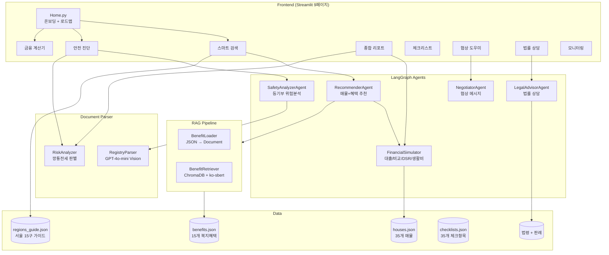

# 🏠 Young & Home

> **처음 집 구하는 청년을 위한 AI 주거 파트너**

집 찾기 → 안전 확인 → 계약 → 입주까지, 아무것도 몰라도 AI가 옆에서 다 챙겨줍니다.

---

## 📌 이런 문제를 해결합니다

| 고민 | Young & Home |
|------|-------------|
| 😰 "어떤 혜택 받을 수 있지?" | AI가 내 조건에 맞는 **정부 지원금·대출** 자동 매칭 |
| 😰 "이 집 전세사기 아닐까?" | **등기부등본 업로드** 또는 **3초 자가진단**으로 위험도 즉시 확인 |
| 😰 "집주인한테 뭐라고 말하지?" | AI가 **협상 메시지·내용증명** 대신 작성 |
| 😰 "계약서가 이해 안 돼" | **법률 챗봇**이 판례 기반으로 쉽게 설명 |
| 😰 "이 동네 살만해?" | **서울 15구 시세·교통·치안** 가이드 + 주민 후기 |
| 😰 "월급으로 생활 되나?" | **생활비 시뮬레이션**으로 수입 vs 지출 즉시 확인 |

---

## ✨ 주요 기능

### 🔍 스마트 매물 검색
나이·소득·자산 입력 → 받을 수 있는 혜택 + 조건 맞는 매물 + 지역 가이드를 한 번에

### 🛡️ 안전 진단 (3종)
- **AI 등기부 분석** — PDF/이미지 업로드 → 근저당·압류·소유자 교차 검증
- **깡통전세 자가진단** — 보증금/시세/근저당 3개만 입력 → 즉시 위험도 게이지
- **SOS 비상 대응** — 긴급 연락처 + 상황별 행동 가이드 + 피해 복구 타임라인

### 💰 금융 계산기 (5탭)
- AI 대출 추천 (중기청/버팀목) + **은행 스크립트** + **신청 서류 체크리스트**
- 전세 vs 월세 비교 · DSR 한도 진단 · **생활비 시뮬레이션** · 금융 용어 사전

### 📊 원클릭 종합 리포트
매물 하나 선택 → 안전 진단 + 대출 시뮬 + 생활비 + 지역 가이드를 **한 페이지에**

### ✅ 체크리스트
집 보기(15항목) → 계약(11항목) → 입주(9항목) + **방문 전 질문 생성기**

### 📝 협상 도우미 · ⚖️ 법률 상담 · 📡 모니터링

---

## 🏗️ 아키텍처


```mermaid
graph TB
    subgraph Frontend["Frontend (Streamlit 9페이지)"]
        HOME[Home.py<br/>온보딩 + 로드맵]
        SEARCH[스마트 검색]
        SAFETY[안전 진단]
        FINANCE[금융 계산기]
        REPORT[종합 리포트]
        CHECK[체크리스트]
        NEG_P[협상 도우미]
        LEGAL_P[법률 상담]
        MON[모니터링]
    end

    subgraph Agents["LangGraph Agents"]
        REC[RecommenderAgent<br/>매물+혜택 추천]
        ANA[SafetyAnalyzerAgent<br/>등기부 위험분석]
        NEG[NegotiatorAgent<br/>협상 메시지]
        LEG[LegalAdvisorAgent<br/>법률 상담]
        FIN[FinancialSimulator<br/>대출/비교/DSR/생활비]
    end

    subgraph RAG["RAG Pipeline"]
        LOADER[BenefitLoader<br/>JSON → Document]
        RET[BenefitRetriever<br/>ChromaDB + ko-sbert]
    end

    subgraph OCR["Document Parser"]
        PARSER[RegistryParser<br/>GPT-4o-mini Vision]
        RISK[RiskAnalyzer<br/>깡통전세 판별]
    end

    subgraph Data["Data"]
        BENEFITS[(benefits.json<br/>15개 복지혜택)]
        HOUSES[(houses.json<br/>35개 매물)]
        REGIONS[(regions_guide.json<br/>서울 15구 가이드)]
        CHECKS[(checklists.json<br/>35개 체크항목)]
        LAW[(법령 + 판례)]
    end

    HOME --> SEARCH & SAFETY & FINANCE
    SEARCH --> REC
    SAFETY --> ANA & RISK
    REPORT --> FIN & RISK
    NEG_P --> NEG
    LEGAL_P --> LEG
    REC --> RAG --> BENEFITS
    REC --> FIN --> HOUSES
    ANA --> PARSER
    LEG --> LAW
    SEARCH --> REGIONS
```

---

## 📁 디렉토리 구조

```
young-and-home/
├── Home.py                         # 온보딩 위저드 + 대시보드 + 로드맵
├── pages/
│   ├── 1_🔍_스마트_검색.py          # 매물+혜택 AI 검색 + 지역 분석 + 후기
│   ├── 2_👤_내_프로필.py            # 재무·직장·거주 프로필 (session_state)
│   ├── 2_🛡️_안전_진단.py           # 등기부 AI 분석 + 깡통전세 자가진단 + SOS
│   ├── 3_📝_협상_도우미.py          # 협상 메시지 + 내용증명 생성
│   ├── 4_⚖️_법률_상담.py           # 법률 챗봇 (법령+판례)
│   ├── 5_💰_금융_계산기.py          # 대출추천/비교/DSR/생활비/용어사전
│   ├── 6_📡_모니터링.py            # 등기 변동 감시
│   ├── 7_✅_체크리스트.py           # 집보기/계약/입주 체크 + 질문 생성기
│   └── 8_📊_종합_리포트.py          # 매물별 원클릭 종합 분석 + 비교
├── src/
│   ├── agents/                     # AI 에이전트
│   │   ├── recommender.py          # 매물+혜택 추천 (LangGraph)
│   │   ├── analyzer.py             # 안전 분석 (LangGraph)
│   │   ├── legal.py                # 법률 상담
│   │   ├── negotiator.py           # 협상 메시지
│   │   └── finance_agent.py        # 금융 시뮬레이터 (통합)
│   ├── rag/                        # RAG 파이프라인
│   │   ├── loader.py               # benefits.json → Document
│   │   └── retriever.py            # ChromaDB 벡터 검색
│   ├── ocr/
│   │   └── parser.py               # 등기부/계약서 파싱 + 위험 분석
│   └── utils/
│       ├── ui.py                   # UI 컴포넌트 + CSS + 사이드바
│       ├── lang.py                 # i18n (KO/EN)
│       └── reviews.py              # 지역 후기 (SQLite)
├── data/
│   ├── welfare/benefits.json       # 정부 혜택 15개
│   ├── housing/
│   │   ├── houses.json             # 매물 35개 (좌표 포함)
│   │   ├── regions_guide.json      # 서울 15구 시세·교통·팁
│   │   └── checklists.json         # 체크리스트 (집보기/계약/입주)
│   └── legal/                      # 주택임대차보호법 + 판례 5건
└── docker-compose.yml              # n8n + FastAPI (선택)
```

---

## 📊 데이터 현황

| 데이터 | 개수 | 내용 |
|--------|------|------|
| 복지 혜택 | 15개 | 청년월세지원, LH전세임대, SH행복주택, 중기청, 버팀목, 청년도약계좌 등 |
| 매물 | 35개 | 서울 전역 (원룸/오피스텔/공공임대/쉐어하우스/고시원, 좌표 포함) |
| 지역 가이드 | 15구 | 마포·서대문·관악·성동·광진·종로·동대문·성북·용산·동작·강남·송파·노원·강서·영등포 |
| 체크리스트 | 35항목 | 집보기 15개 + 계약 전 11개 + 입주 당일 9개 |
| 법령 | 핵심 조항 | 대항력, 갱신청구권, 증액제한, 보증금 보호 |
| 판례 | 5건 | 전세사기, 보증금 반환, 수선의무 관련 |

---

## 🚀 시작하기

```bash
# 1. 클론
git clone https://github.com/soccz/young-and-home.git
cd young-and-home

# 2. 가상환경 + 의존성
python3 -m venv venv
source venv/bin/activate
pip install -r requirements.txt

# 3. API 키 설정
cp .env.example .env
# .env 파일을 열어 OPENAI_API_KEY 입력

# 4. 실행
streamlit run Home.py
```

> 첫 실행 시 한국어 임베딩 모델(~400MB)이 자동 다운로드됩니다.

### 필요한 것

- **OpenAI API 키** 하나면 모든 AI 기능 동작
- 금융 계산기·체크리스트·깡통전세 자가진단은 API 없이도 사용 가능

---

## 🛠️ 기술 스택

| 영역 | 기술 |
|------|------|
| Frontend | Streamlit (멀티페이지 9개, 반응형 CSS) |
| AI/Agent | LangChain + LangGraph + GPT-4o-mini |
| RAG | ChromaDB + sentence-transformers (jhgan/ko-sbert-nli) |
| Data | JSON + SQLite (후기 시스템) |
| Automation | n8n (등기 모니터링 워크플로우) |
| Infra | Docker Compose (선택) |

---

## ⚠️ 현재 상태

| 기능 | 상태 | 비고 |
|------|------|------|
| 온보딩 위저드 | ✅ | 4단계 프로필 → 맞춤 로드맵 |
| 스마트 검색 | ✅ | 혜택 매칭 + 매물 추천 + 지역 분석 + 후기 |
| 안전 진단 | ✅ | AI 등기부 분석 + 깡통전세 자가진단 + SOS |
| 종합 리포트 | ✅ | 안전+대출+생활비 한 페이지 |
| 금융 계산기 | ✅ | 5탭 (대출추천/비교/DSR/생활비/용어) |
| 체크리스트 | ✅ | 35항목 + 질문 생성기 |
| 협상 도우미 | ✅ | 5종 (보증보험/특약/수리/조건변경/내용증명) |
| 법률 상담 | ✅ | 법령+판례 기반 + FAQ 6개 |
| 모니터링 | 🟡 | 시뮬레이션 모드 (n8n 연동 준비) |
| FastAPI 백엔드 | 🔴 | 미구현 (추후 추가 예정) |

---

## 📜 라이선스

MIT License — Team Young & Home
